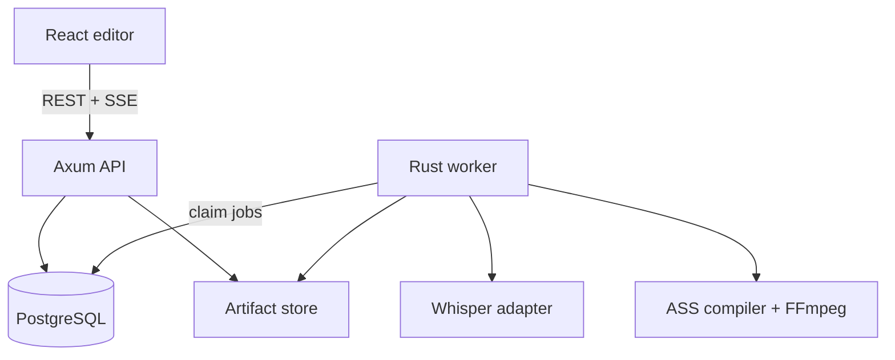
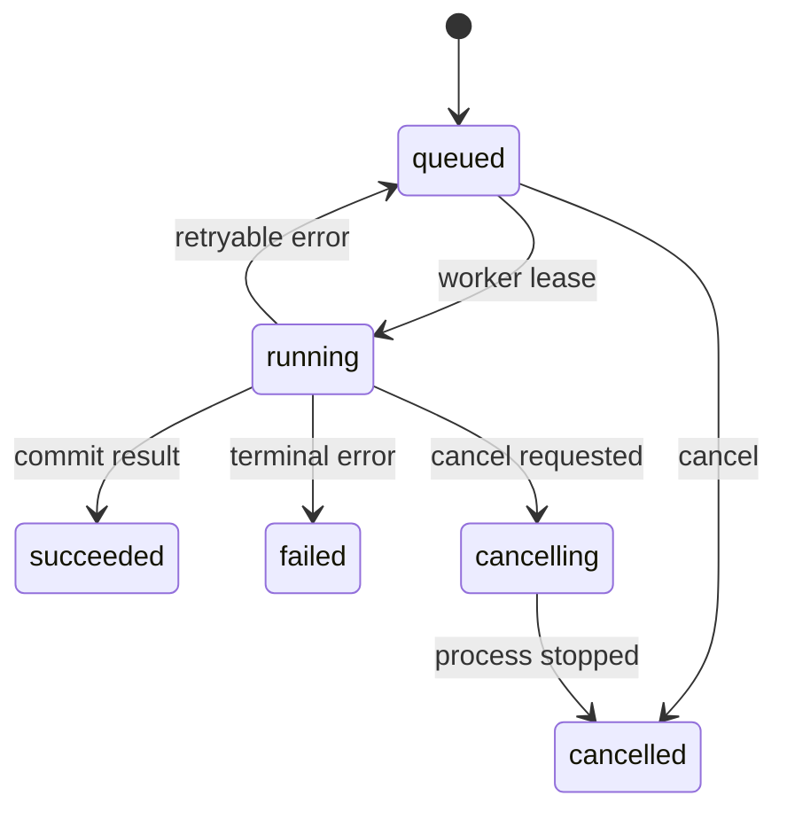
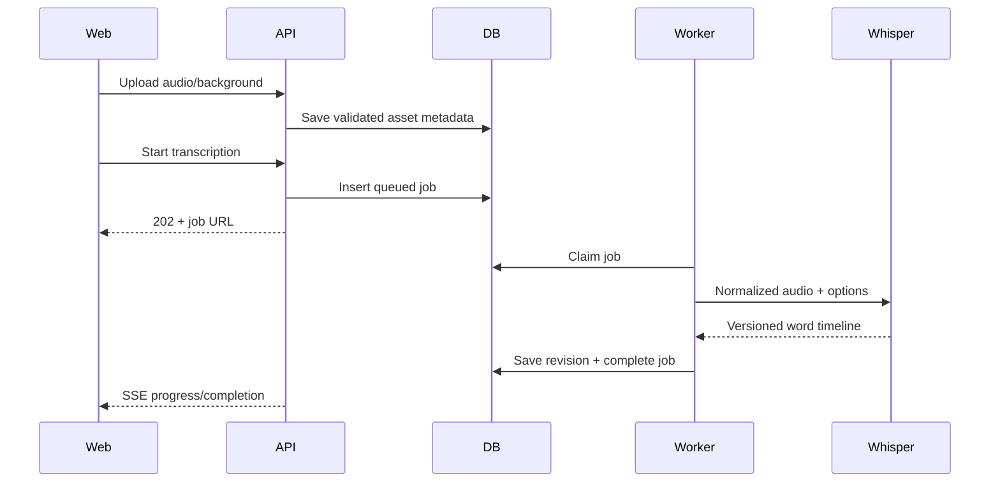
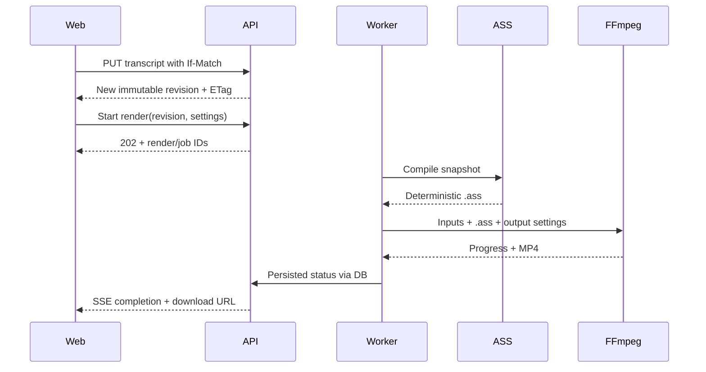

# Lyrit Loom — System Architecture

**Architecture version:** 1.0

**Scope:** single-user/private beta through production-ready single-region deployment

## 1. Architecture

### 1.1 Product boundary

The application converts an audio track and still background image into a lyric video:

1. ingest and validate media;
2. produce word-level timestamps with Whisper;
3. let the user correct words and timing against a waveform;
4. compile the approved timeline into Advanced SubStation Alpha (`.ass`);
5. render an MP4 with FFmpeg/libass; and
6. retain the input, editable transcript revisions, render metadata, and final artifact.

The first release supports one audio track, one background image, one active transcript, and one output video per render request. The architecture deliberately leaves room for video backgrounds, templates, multiple aspect ratios, and distributed workers without putting those features into the MVP.

### 1.2 Architectural stance

Use a **modular monolith with out-of-process workers**:

- the API and worker share Rust domain/application crates;
- PostgreSQL is both the system of record and the durable job queue;
- the worker invokes Whisper and FFmpeg through explicit adapters;
- uploaded and generated bytes live behind an `ArtifactStore` interface;
- the React client depends on the OpenAPI contract, not Rust implementation details.

This is simpler than a service mesh, but it preserves the two boundaries most likely to scale independently: transcription and rendering.



### 1.3 Quality attributes

| Attribute       | Design response                                                                                                                           |
| --------------- | ----------------------------------------------------------------------------------------------------------------------------------------- |
| Correctness     | Immutable transcript revisions; render jobs pin the exact revision and settings used.                                                     |
| Reliability     | Durable jobs, leases, heartbeats, bounded retries, idempotency keys, and atomic artifact promotion.                                       |
| Security        | Streamed uploads, content probing, size/duration limits, generated storage keys, subprocess argument arrays, and isolated job workspaces. |
| Reproducibility | Persist tool/model versions, render settings, input hashes, ASS output, and FFmpeg command manifest.                                      |
| Responsiveness  | API requests enqueue work and return quickly; SSE publishes progress; editor preview is client-side.                                      |
| Portability     | External binaries and storage sit behind adapters; CPU development and optional GPU workers use the same job contract.                    |
| Operability     | Structured tracing, job events, health/capability checks, metrics, and explicit error codes.                                              |

### 1.4 System components and responsibilities

| Component               | Owns                                                                                                                  | Must not own                                                              |
| ----------------------- | --------------------------------------------------------------------------------------------------------------------- | ------------------------------------------------------------------------- |
| React web app           | Upload UX, project screen, waveform/timeline editing, draft preview, job progress, result download                    | Media encoding, authoritative timestamp generation, durable project state |
| Axum API                | Authentication boundary, validation, project commands/queries, upload streaming, concurrency checks, idempotency, SSE | CPU/GPU-heavy transcription or rendering                                  |
| Application layer       | Use-case orchestration and transaction boundaries                                                                     | Axum types, SQL strings, filesystem paths, subprocess details             |
| Domain layer            | Project, transcript, job, render states; invariants; ASS-neutral animation intent                                     | Database, HTTP, Python, FFmpeg                                            |
| PostgreSQL repositories | Durable entities, immutable revisions, job claiming/leases, idempotency records                                       | Media bytes                                                               |
| Artifact store          | Original uploads, normalized audio, ASS manifests, MP4 outputs; local and S3-compatible implementations               | Business state transitions                                                |
| Rust worker             | Job claiming, heartbeats, cancellation, retry classification, adapter orchestration, progress persistence             | HTTP request lifecycle                                                    |
| Whisper adapter         | Audio-to-word-timeline conversion through a versioned JSON contract                                                   | Project/render business rules                                             |
| ASS compiler            | Deterministic mapping from render snapshot to escaped ASS script                                                      | Running FFmpeg or reading project state                                   |
| FFmpeg adapter          | Probe, normalize, render, progress parsing, process termination, capability reporting                                 | HTTP responses or direct database writes                                  |

### 1.5 Monorepo layout

```text
lyrit-loom/
├── Cargo.toml                    # Rust workspace
├── Cargo.lock                    # committed for this private application
├── rust-toolchain.toml
├── package.json                  # shared JS commands only
├── pnpm-workspace.yaml
├── pnpm-lock.yaml
├── .env.example
├── apps/
│   ├── api/                      # Axum binary; composition root and HTTP routes
│   │   ├── Cargo.toml
│   │   └── src/
│   │       ├── main.rs
│   │       ├── routes/
│   │       ├── middleware/
│   │       └── state.rs
│   ├── worker/                   # durable transcription/render worker binary
│   │   ├── Cargo.toml
│   │   └── src/
│   │       ├── main.rs
│   │       ├── runner.rs
│   │       └── handlers/
│   ├── web/                      # React + TypeScript + Vite
│   │   ├── package.json
│   │   └── src/
│   │       ├── app/
│   │       ├── features/
│   │       │   ├── projects/
│   │       │   ├── uploads/
│   │       │   ├── transcript/
│   │       │   └── renders/
│   │       ├── components/
│   │       ├── api/
│   │       └── test/
│   └── transcriber/              # Python process adapter for faster-whisper
│       ├── pyproject.toml
│       ├── uv.lock
│       ├── src/lyrit_transcriber/
│       │   ├── __main__.py
│       │   ├── contract.py
│       │   ├── transcribe.py
│       │   └── normalize.py
│       └── tests/
├── crates/
│   ├── domain/                   # entities, value objects, state machines
│   ├── application/              # commands, queries, ports, DTO-independent use cases
│   ├── persistence/              # SQLx repositories and migrations
│   ├── artifact-store/           # local filesystem and S3-compatible adapters
│   ├── transcription/            # process contract and Whisper adapter port
│   ├── ass-engine/               # ASS document model, escaping, layout, animations
│   ├── media/                    # ffprobe/FFmpeg process adapters
│   ├── api-model/                # serialized request/response models
│   └── test-support/             # fixtures, fake clock/store/transcriber
├── contracts/
│   ├── openapi.yaml              # source of truth for public HTTP contract
│   └── transcriber.schema.json   # generated/added when implementation begins
├── packages/
│   ├── api-client/               # generated TypeScript client and types
│   └── ui/                       # optional shared UI primitives
├── db/
│   └── migrations/
├── infra/
│   ├── compose.yaml
│   ├── containers/
│   │   ├── api.Dockerfile
│   │   ├── worker.Dockerfile
│   │   └── web.Dockerfile
│   └── fonts/                    # pinned, licensed render fonts
├── fixtures/
│   ├── audio/
│   ├── images/
│   ├── transcripts/
│   └── golden/
├── scripts/
│   ├── check-toolchain.sh
│   ├── generate-api-client.sh
│   └── smoke-render.sh
└── docs/
    ├── ARCHITECTURE.md
    ├── DELIVERY_GUIDE.md
    └── decisions/
```

Rules for dependency direction:

```text
apps -> api-model/application/adapters -> domain
adapters implement application ports
domain imports no framework, database, filesystem, or process crate
web imports the generated API client, never Rust source
```

### 1.6 Runtime topology

Development uses Docker Compose for PostgreSQL and optional object storage; the API, web app, and worker may run directly for fast iteration. A single deployment can run:

- one web container;
- one API container;
- one general worker with FFmpeg and CPU transcription;
- one PostgreSQL instance; and
- one persistent artifact volume.

When load requires it, keep the API unchanged and split workers by capability:

- `WORKER_QUEUES=render` on CPU-rich nodes;
- `WORKER_QUEUES=transcribe` on GPU-enabled nodes;
- S3-compatible artifact storage so every worker sees the same bytes.

No distributed filesystem assumptions may leak into domain or application crates.

### 1.7 Domain model

#### Project

`Project` is the user-facing aggregate. It references, rather than embeds, large media artifacts.

```text
Project
  id, owner_id, name
  video_settings { width, height, fps, background_fit }
  audio_asset_id?
  background_asset_id?
  active_transcript_revision_id?
  status: draft | ready | rendering | completed | failed
  created_at, updated_at
```

`ready` means the project has valid audio, background, and an active transcript. A project can have many completed renders.

#### Asset

```text
Asset
  id, project_id, kind: audio | background | normalized_audio | subtitle | video
  storage_key, original_filename?, media_type, bytes, sha256
  duration_ms?, width?, height?
  tool_metadata JSON
  created_at
```

Client filenames are display metadata only. Storage paths are generated from IDs.

#### Transcript revision

Every accepted transcription or editor save creates an immutable revision. A revision stores cues containing timestamped words:

```text
TranscriptRevision
  id, project_id, revision_number, language, source
  duration_ms, cues[], created_at

Cue
  id, start_ms, end_ms, words[]

Word
  id, text, start_ms, end_ms, confidence?
```

Invariants:

- all times are integer milliseconds;
- `0 <= start_ms < end_ms <= audio_duration_ms + tolerance`;
- words within a cue are ordered and do not overlap beyond a small normalization tolerance;
- cue bounds cover their first/last word;
- word IDs remain stable during text/timing edits when the word is logically unchanged;
- a render references one immutable revision, never the mutable project pointer.

Store the revision document as JSONB initially. This keeps timeline reads atomic and makes render snapshots simple. If later analytics need word-level SQL, add a projection rather than prematurely normalizing the editor document.

#### Job and render

```text
Job
  id, type: transcribe | render
  status: queued | running | cancelling | succeeded | failed | cancelled
  phase, progress (0..1), attempt, max_attempts
  payload JSONB, result JSONB?, error JSONB?
  lease_owner?, lease_expires_at?, heartbeat_at?
  created_at, started_at?, finished_at?

Render
  id, project_id, job_id, transcript_revision_id
  settings JSONB, status, output_asset_id?
  manifest JSONB, created_at, completed_at?
```

`Render.manifest` records input hashes, transcript revision, style/animation settings, ASS compiler version, Whisper metadata inherited from the transcript, FFmpeg version, font hashes, and the normalized command description. It is the reproducibility record.

### 1.8 Job state machine



Job rules:

- a worker claims a job in a short transaction using row locking and `SKIP LOCKED`;
- a lease and heartbeat make abandoned work recoverable;
- the worker checks cancellation between phases and terminates child processes when requested;
- retry only transient infrastructure failures; invalid media, unsupported codecs, and deterministic compiler errors are terminal;
- a render result is visible only after its artifact is fully written and atomically promoted;
- progress and phase are persisted so polling works even if the SSE connection drops.

### 1.9 Persistence model

Recommended tables:

| Table                  | Important constraints/indexes                                             |
| ---------------------- | ------------------------------------------------------------------------- |
| `projects`             | owner/name fields; foreign keys to active assets/revision; `updated_at`   |
| `assets`               | unique `storage_key`; `(project_id, kind)`; `sha256`                      |
| `transcript_revisions` | unique `(project_id, revision_number)`; JSONB document                    |
| `jobs`                 | partial index on queued jobs by `type, created_at`; index on lease expiry |
| `job_events`           | `(job_id, sequence)` for replay/debugging; bounded retention              |
| `renders`              | `(project_id, created_at desc)`; unique `job_id`                          |
| `idempotency_keys`     | unique `(owner_id, operation, key)`; request hash and stored response     |

Use SQLx migrations and checked queries in CI. Keep database transactions short; FFmpeg, Whisper, and artifact transfers never run while a transaction is open.

### 1.10 Artifact storage

Define a narrow async port:

```rust
#[async_trait]
pub trait ArtifactStore: Send + Sync {
    async fn put(&self, key: &ArtifactKey, body: ByteStream) -> Result<StoredObject>;
    async fn open(&self, key: &ArtifactKey) -> Result<ByteStream>;
    async fn materialize(&self, key: &ArtifactKey, destination: &Path) -> Result<()>;
    async fn delete(&self, key: &ArtifactKey) -> Result<()>;
}
```

The local adapter writes to a temporary sibling and renames after success. The S3-compatible adapter uploads to a temporary key, verifies metadata/checksum where supported, then copies/promotes to the final key. Database rows reference only final keys.

Retention policy should be explicit:

- original uploads: retained while the project exists;
- normalized audio and job workspaces: disposable cache;
- ASS and render manifest: retain with the render for reproducibility;
- failed partial outputs: delete after a short diagnostic window;
- final videos: retained until user deletion or product quota policy.

### 1.11 Core workflows

#### Upload and transcription



Upload validation is two-stage:

1. API: enforce request size, stream bytes, calculate SHA-256, and reject obvious unsupported media.
2. Worker or media adapter: use `ffprobe` to verify decoded streams, duration, dimensions, and codec/container facts before expensive work.

#### Edit and render



The browser preview is intentionally approximate. FFmpeg/libass output is authoritative because browser text shaping, font fallback, and CSS animation timing differ from libass.

## 2. Contracts and boundaries

### 2.1 HTTP API conventions

The machine-readable contract is `contracts/openapi.yaml`.

- Base path: `/api/v1`.
- JSON uses `snake_case` to match Serde defaults and job/process manifests.
- IDs are UUID strings.
- Times in media documents are integer milliseconds; wall-clock times are RFC 3339 UTC strings.
- Job-creating POST requests require `Idempotency-Key`.
- Transcript reads return `ETag`; updates require `If-Match` and create a new revision.
- Errors use `application/problem+json` with a stable `code`, user-safe `detail`, and `request_id`.
- Long operations return `202 Accepted` with canonical job and status URLs.
- SSE is an optimization. `GET /jobs/{id}` is always sufficient to recover current state.

Representative error codes:

| Code                      | Meaning                                             | Retry?                 |
| ------------------------- | --------------------------------------------------- | ---------------------- |
| `validation_failed`       | Request fields violate the contract                 | No; fix request        |
| `asset_missing`           | Required audio/background is absent                 | No; upload asset       |
| `unsupported_media`       | Probe/decode rejected the file                      | No; replace file       |
| `revision_conflict`       | `If-Match` is stale                                 | No; refetch and merge  |
| `job_not_cancellable`     | Job is already terminal                             | No                     |
| `transcriber_unavailable` | Transcriber process/infrastructure failed           | Usually yes            |
| `render_failed`           | FFmpeg/libass returned a terminal failure           | Depends on diagnostics |
| `capacity_exhausted`      | Worker capacity or quota is temporarily unavailable | Yes, with backoff      |

### 2.2 Transcriber process contract

The Rust worker owns the process and passes a JSON request file plus output path. Do not parse log text as data.

Request shape:

```json
{
  "contract_version": "1",
  "request_id": "uuid",
  "input_path": "/job/input/audio-16k.wav",
  "output_path": "/job/output/transcript.json",
  "language": "auto",
  "model": "configured-default",
  "word_timestamps": true,
  "vad": { "enabled": true },
  "initial_prompt": null
}
```

Result shape:

```json
{
  "contract_version": "1",
  "language": "en",
  "language_probability": 0.98,
  "duration_ms": 182430,
  "model": {
    "engine": "faster-whisper",
    "name": "configured-default",
    "revision": "pinned"
  },
  "segments": [
    {
      "start_ms": 420,
      "end_ms": 2810,
      "text": "Example lyric line",
      "words": [
        {
          "text": "Example",
          "start_ms": 420,
          "end_ms": 1180,
          "confidence": 0.94
        },
        {
          "text": "lyric",
          "start_ms": 1200,
          "end_ms": 1880,
          "confidence": 0.91
        },
        { "text": "line", "start_ms": 1900, "end_ms": 2810, "confidence": 0.96 }
      ]
    }
  ],
  "warnings": []
}
```

Contract requirements:

- structured data is written atomically to `output_path`;
- stdout/stderr are diagnostic logs only;
- process exit `0` means a schema-valid output exists;
- nonzero exit codes are classified by a small stable set such as invalid input, model unavailable, out of memory, and internal failure;
- the Rust side validates schema and timeline invariants even when the process exits successfully;
- model downloads do not happen implicitly in production jobs; images/models are prepared during deployment.

### 2.3 ASS compiler boundary

The compiler accepts a render snapshot, not a database handle:

```rust
pub struct RenderSnapshot {
    pub transcript: TranscriptRevision,
    pub video: VideoSettings,
    pub typography: Typography,
    pub animation: AnimationPreset,
}

pub trait SubtitleCompiler {
    fn compile(&self, snapshot: &RenderSnapshot) -> Result<CompiledAss, CompileError>;
}
```

`CompiledAss` contains UTF-8 ASS text, a compiler version, warnings, event count, and an optional debug mapping from word IDs to event line numbers.

The compiler owns:

- ASS time formatting and section ordering;
- escaping `\\`, `{`, `}`, and line-break-sensitive text;
- style names and deterministic event generation;
- conversion of semantic presets into tags such as `\\k`, `\\fad`, `\\move`, transforms, and positioning;
- viewport-safe margins and collision policy;
- minimum/maximum animation duration rules.

It must never interpolate raw user text into override-tag blocks. User text is always escaped as text payload.

### 2.4 FFmpeg adapter boundary

Expose typed operations rather than accepting arbitrary command fragments:

```rust
pub trait MediaEngine: Send + Sync {
    async fn capabilities(&self) -> Result<MediaCapabilities>;
    async fn probe(&self, input: &Path) -> Result<MediaProbe>;
    async fn normalize_for_asr(&self, input: &Path, output: &Path) -> Result<()>;
    async fn render(&self, request: RenderCommand, progress: ProgressSink) -> Result<RenderProbe>;
}
```

`RenderCommand` contains paths and typed codec/layout values. It does not contain a raw shell command or free-form filtergraph from the client.

### 2.5 Frontend state boundary

State ownership is divided deliberately:

| State                                                        | Owner                                                             |
| ------------------------------------------------------------ | ----------------------------------------------------------------- |
| Projects, transcript revision, jobs, renders                 | TanStack Query cache backed by API                                |
| Unsaved word/timing edits, current selection, zoom, playhead | Zustand editor store                                              |
| Form validation                                              | Form-local state and schema validator                             |
| Audio element and waveform instance                          | Feature hook/component lifecycle                                  |
| Upload progress                                              | Upload task state using XHR or a library exposing progress events |

On a successful transcript save, replace the server cache with the returned revision, update the ETag, and clear the dirty editor state. On `412 Precondition Failed`, preserve the local draft and present a reload/merge path.

## 3. Decisions and evolution

### 3.1 Key decisions

| Decision               | Choice                                       | Consequence                                                                         |
| ---------------------- | -------------------------------------------- | ----------------------------------------------------------------------------------- |
| Initial system shape   | Modular monolith + worker                    | Low operational overhead; still separates heavy work from HTTP                      |
| Job queue              | PostgreSQL-backed leases                     | No Redis dependency; adequate for initial scale; queue logic needs careful tests    |
| Transcript persistence | Immutable JSONB revisions                    | Simple editor reads and deterministic renders; word analytics use projections later |
| Whisper integration    | Python process contract using faster-whisper | Strong ecosystem/GPU path; Python runtime is isolated and version-pinned            |
| Subtitle generation    | Native Rust ASS compiler                     | Deterministic, testable, no string-template logic in worker handlers                |
| Render engine          | FFmpeg subprocess with libass                | Proven codec/subtitle pipeline; deployment must verify build capabilities           |
| Progress transport     | persisted state + SSE                        | Simple server-to-client updates; polling remains reliable fallback                  |
| Storage                | adapter: local first, S3-compatible later    | Fast local development; no rewrite for multi-node workers                           |
| API types              | OpenAPI-first generated TS client            | Reduces frontend/backend drift                                                      |

### 3.2 Explicitly deferred

- user-to-user collaboration and real-time shared editing;
- arbitrary user-provided FFmpeg options or ASS override tags;
- multi-track audio mixing and scene-based video editing;
- automatic lyric fetching from third-party catalogs;
- payments, quotas, and public sharing pages;
- diarization and speaker identity;
- Kubernetes, a message broker, and multi-region deployment;
- pixel-identical browser preview of libass output.

### 3.3 Evolution triggers

Change architecture only when evidence reaches a trigger:

| Trigger                                      | Evolution                                                                        |
| -------------------------------------------- | -------------------------------------------------------------------------------- |
| API and workers run on different hosts       | Switch artifact adapter from local volume to S3-compatible storage               |
| PostgreSQL queue contention is measurable    | Introduce a dedicated broker behind the existing job port                        |
| GPU transcription is routinely backlogged    | Deploy `transcribe` workers independently; keep the JSON contract                |
| Render presets become third-party/extensible | Add a versioned preset schema and sandboxed validation; never expose raw filters |
| Transcript queries need per-word analytics   | Add normalized projection tables fed from immutable revisions                    |
| Browser preview mismatch blocks editing      | Add a low-resolution preview-render endpoint or a WASM/libass preview experiment |

### 3.4 Capability checks

At startup and in `/health/ready`, report—not merely assume:

- database connectivity and migration compatibility;
- artifact-store write/read/delete probe in the deployment environment;
- FFmpeg and ffprobe executable versions;
- presence of the `subtitles` filter and H.264/AAC encoders required by the selected profile;
- availability and hashes of configured fonts;
- transcriber runtime/model readiness for workers that claim transcription jobs.

Readiness failure prevents a worker from claiming jobs it cannot complete. Liveness should remain independent so orchestration can restart unhealthy processes.

### 3.5 Reference documentation

- [Axum documentation](https://docs.rs/axum/latest/axum/)
- [SQLx documentation](https://docs.rs/sqlx/latest/sqlx/)
- [React documentation](https://react.dev/)
- [Vite guide](https://vite.dev/guide/)
- [faster-whisper repository](https://github.com/SYSTRAN/faster-whisper)
- [FFmpeg command documentation](https://ffmpeg.org/ffmpeg.html)
- [FFmpeg filters: `subtitles`/libass](https://ffmpeg.org/ffmpeg-filters.html#subtitles-1)
- [OpenAPI Specification 3.1.1](https://spec.openapis.org/oas/v3.1.1.html)
